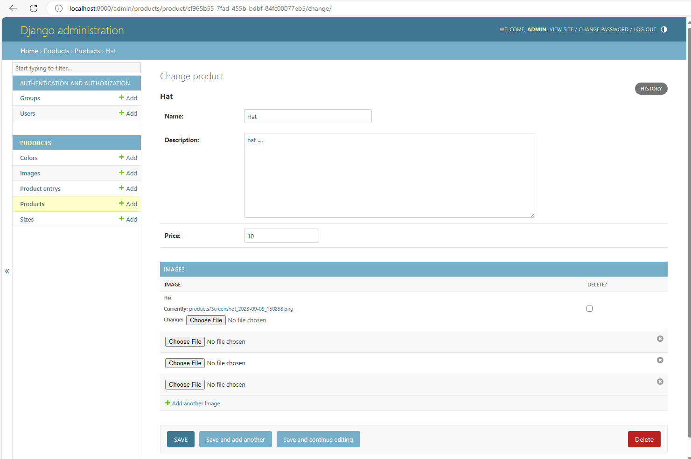

# API with Express and Node.js
#### Create a simple REST API using Express.

- Express server has been create.
- Location: express_server
- Instructions on how to run the app: [Express server](./express_server/README.md)

### Implement CRUD operations for a "User" resource.
- Has been completed.- Has been completed.
# Web Server with Django and Python
## Create a Django web server with one model, e.g., "Product".

- Django server has been create.
- Location: django_server
- Instructions on how to run the app: [Django server](./django_server/README.md)
- Model created: ProductEntry, Product, Image, Size, Color

## Implement CRUD operations via Django's admin interface.

- Has been completed.
- Use admin or staff acount to access Django's admin interface. [Admin interface](http://localhost:8000/admin/login/?next=/admin/)




# API-to-Database Connection
# Connect your Express API to a SQLite database using any ORM.

- Has been completed.
- Use [sequelize](https://sequelize.org/) to connect SQLite database.

# Store and retrieve "User" data.

- Has been completed.
- Can get, create, update and delete user.
- Import file Postman to test [Postman](./tmp/assigment%20web%20express%20server.postman_collection.json) (tmp\assigment web express server.postman_collection.json).

# API Proxy with Python
## Create a Python script that acts as a proxy.

- Has been completed.
- Script location `django_server\django_server\proxy.py`

```python
import json
from urllib.parse import parse_qsl

import requests
from django.conf import settings
from django.core.exceptions import BadRequest
from django.http import HttpResponse
from django.urls import re_path
from django.views.decorators.csrf import csrf_exempt
from django.views.decorators.http import require_http_methods

EXPRESS_SERVER_URL = settings.EXPRESS_SERVER_URL


def get_headers(environ):
    """
    Retrieve the HTTP headers from a WSGI environment dictionary.
    """
    headers = {}
    for key, value in environ.items():
        if key.startswith('HTTP_') and key != 'HTTP_HOST':
            headers[key[5:].lower().replace('_', '-')] = value
        elif key == 'CONTENT_TYPE':
            headers[key.lower().replace('_', '-')] = value
    return headers


def get_request_args(request):
    """
    Create additional arguments for sending to request.
    """
    requests_args = {}

    headers = get_headers(request.META)
    params = request.GET.copy()

    requests_args['headers'] = headers
    requests_args['params'] = params

    # Get data from request.
    body = parse_body(request)
    if file := body.get("files"):
        requests_args["files"] = {"files": file}

    if json_data := body.get("json"):
        requests_args["json"] = json_data

    if data := body.get("data"):
        requests_args["data"] = data

    return requests_args


def parse_json_data(request):
    """
    Access the JSON data from the request body
    """
    try:
        json_data = json.loads(request.body)
        return {"json": json_data}
    except json.JSONDecodeError:
        return {}


def parse_form_data(request):
    """Access multipart/form-data form data from the request"""
    return {"files": request.body}


def parse_url_end_coded(request):
    """Access application/x-www-form-urlencoded form data from the request."""
    data_str = str(request.body, encoding='utf-8')
    data_list = parse_qsl(data_str)
    form_data = dict(data_list)

    return {"data": form_data}


def parse_body(request):
    """Parse data from request."""
    content_type = request.content_type
    if content_type == "multipart/form-data":
        return parse_form_data(request)
    elif content_type == "application/json":
        return parse_json_data(request)
    elif content_type == "application/x-www-form-urlencoded":
        return parse_url_end_coded(request)
    elif content_type == "text/plain" and str(request.body, encoding="utf-8") == "":
        # Return empty if content_type is 'text/plain' and body is empty.
        return {}
    raise BadRequest(f"Content type {content_type} do not supported.")


@csrf_exempt
@require_http_methods(["GET", "POST", "PUT", "DELETE", "PATCH"])
def proxy(request, **kwargs):
    """Proxy forward the request from Django server to Express server."""
    _path = kwargs.get("path", "")
    api_url = f"{EXPRESS_SERVER_URL}/{_path}"

    requests_args = get_request_args(request)

    # Forward the request to the Express API
    response = requests.request(method=request.method, url=api_url, **requests_args)
    # Create a response for the client based on the Express APIs response
    proxy_response = HttpResponse(
        response.content, status=response.status_code, content_type=response.headers.get("content-type"))
    return proxy_response


urlpatterns = [
    re_path(r'^(?P<path>.*)$', proxy, name='proxy'),
]

```
## Forward requests from the Python script to the Express API.

- Has been completed.
- All requests except requests to Django admin are redirected to the Express server.

# Integration
## Make the Django web server fetch "User" data from the Express API via the Python proxy

- Has been completed.
- Can get, create, update and delete user from Express server through Django server.
- Import file Postman to test [Postman](./tmp/assigment%20web%20django%20server.postman_collection.json) (tmp\assigment web django server.postman_collection.json).
